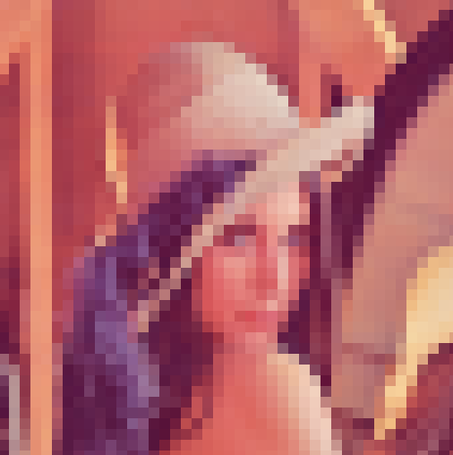
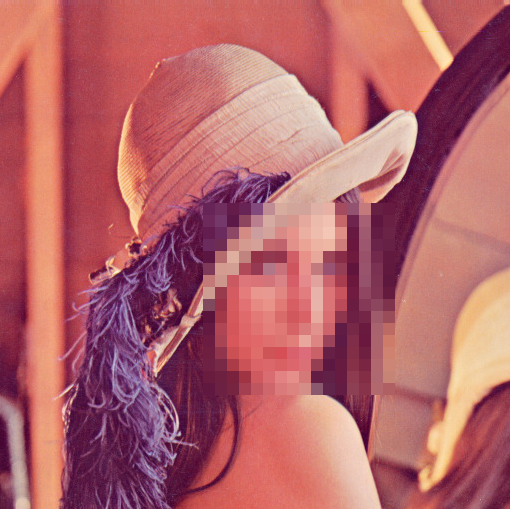

# Efecto Pixelado

Usamos OpenCV para dar el efecto de pixelado a una imagen de cualquier tipo y tamaño.

Podemos aplicar el efecto a una imagen completa o a una región definida de la misma.

*Pixelado aplicado a toda la imagen*

*Pixelado aplicado a una región definida*

La documentación está disponible en [Tutor de Programación](http://acodigo.blogspot.com)