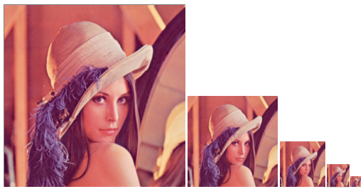
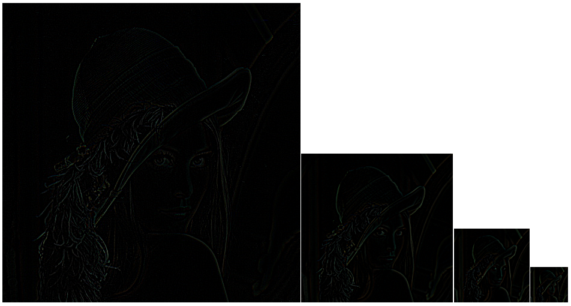

# Pirámide de Imágenes

Generación de pirámides de imágenes con las funciones OpenCV pyrDown y pyrUp.

*Pirámide Gaussiana*

*Pirámide Laplaciana*

La documentación está disponible en [Tutor de Programación](http://acodigo.blogspot.com)